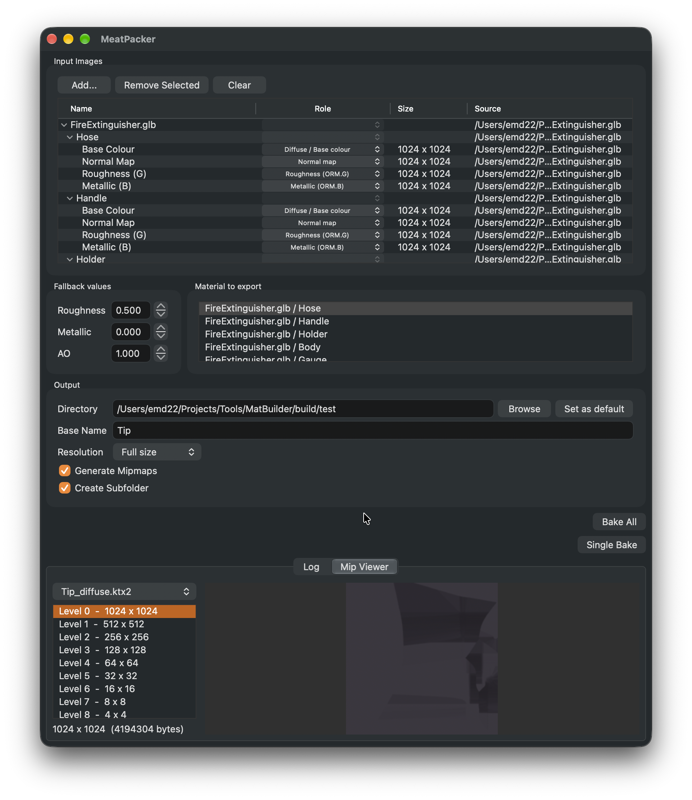

# MatPacker

A tool designed to convert images into KTX2 textures and pack them into game ready textures. You can also pull materials from GLTF models!



## Features

- Select a few images, and they are auto tagged based on their filenames (e.g. `some_material_diffuse.jpg`)
- Load GLTF models, and select each material to pack
- Scale down materials to 1/2, 1/4, or 1/8th size
- Export all images as compressed KTX2 images, ready to be used in game engines
- Preview mips for each baked texture after baking
- Export a copy of a GLTF model with its materials linked to the baked KTX2 textures, optionally embedding the textures in the file. Unused original images are removed, and `KHR_texture_basisu` can be turned off for tools that don't support it

## Output

|                   | R                 | G         | B        | A                |
| ----------------- | ----------------- | --------- | -------- | ---------------- |
| Image 1 (diffuse) | Albedo R          | Albedo G  | Albedo B | Albedo A         |
| Image 2 (normal)  | Normal R          | Normal G  | Normal B | Unused (for now) |
| Image 3 (ORM)     | Ambient Occlusion | Roughness | Metallic | Unused (for now) |

## Library

The baking and glTF export are also built as a shared library (`libmatpacker`) with a C API in [`Include/MatPacker.h`](Include/MatPacker.h).

```c
MPBakeSettings settings;
mp_bake_settings_init(&settings);
settings.output_dir = "baked";
settings.compression = MP_COMPRESSION_BASIS_UASTC;

MPExportOptions options;
mp_export_options_init(&options);
options.embed_textures = 1;

// Bake every material of the model and write a copy that uses the baked textures.
if (mp_bake_gltf("model.glb", "model_baked.glb", &settings, &options, NULL, NULL) != MP_OK) {
    fprintf(stderr, "%s\n", mp_last_error());
}
```

Set `-DMATPACKER_BUILD_GUI=OFF` to build only the library (no wxWidgets needed), and `cmake --install` to install it along with the header.

## AI Disclaimer

LLMs were used in the original prototype of this application, and are used to find and fix bugs.
